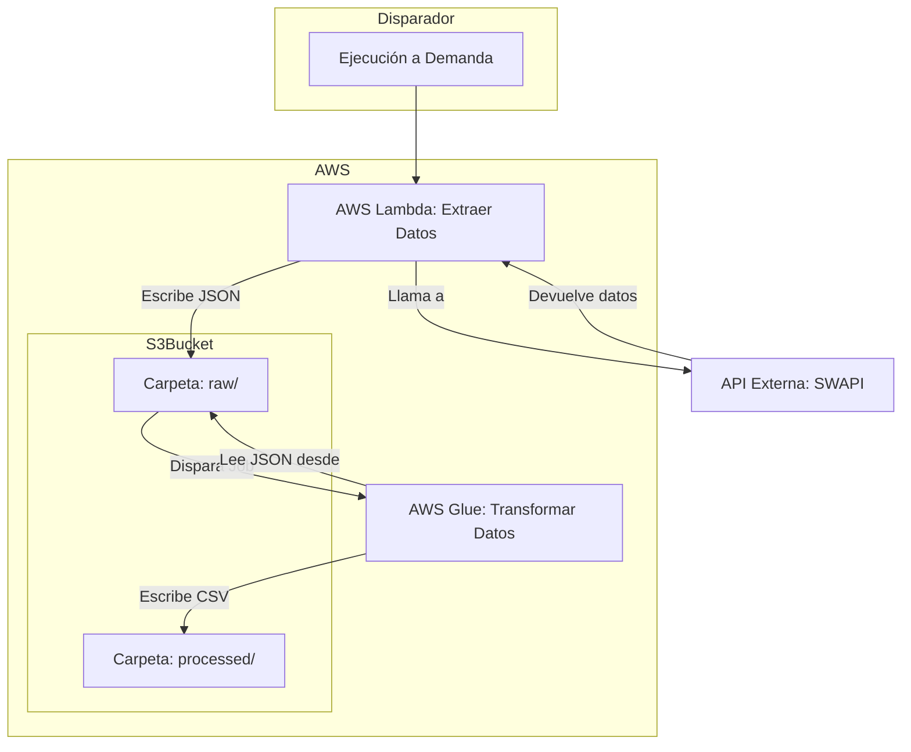

```mermaid
graph TD
    subgraph "Disparador"
        ManualTrigger["Ejecución a Demanda"]
    end

    subgraph "AWS"
        LambdaExtractor["AWS Lambda: Extraer Datos"]
        S3Bucket{"Bucket S3: instructions-67f86d4f"}
        GlueTransformer["AWS Glue: Transformar Datos"]

        subgraph S3Bucket
            RawFolder["Carpeta: raw/"]
            ProcessedFolder["Carpeta: processed/"]
        end
    end

    SwapiAPI["API Externa: SWAPI"]

    ManualTrigger --> LambdaExtractor
    LambdaExtractor -- Llama a --> SwapiAPI
    SwapiAPI -- Devuelve datos --> LambdaExtractor
    LambdaExtractor -- Escribe JSON --> RawFolder
    RawFolder -- Dispara Job --> GlueTransformer
    GlueTransformer -- Lee JSON desde --> RawFolder
    GlueTransformer -- Escribe CSV --> ProcessedFolder
```